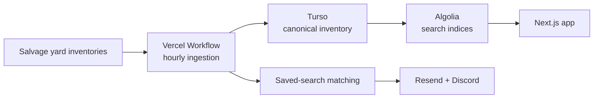

<div align="center">
  <br />
  <a href="https://junkyardindex.com">
    
  </a>
  <h1>Junkyard Index</h1>
  <p>Search salvage yard inventory nationwide before the right donor vehicle is gone.</p>
  <p>
    <a href="https://junkyardindex.com/search">Search inventory</a>
    ·
    <a href="https://junkyardindex.com/pricing">Compare plans</a>
  </p>
</div>

Junkyard Index combines inventory from major self-service salvage yard networks into one fast, searchable index. Search for free, narrow results by vehicle and location, save searches, and receive alerts when new matches arrive.

## Features

- One search across seven salvage yard inventory sources
- Filters for year, make, model, color, state, yard, and source
- Fast, typo-tolerant results with shareable search URLs
- Saved searches for repeat parts hunting
- Email digests and Discord alerts for newly matched vehicles
- Durable hourly ingestion with source validation and atomic inventory reconciliation
- Free, Lite, and Full access tiers with Polar-managed billing

## Inventory sources

- Row52
- LKQ Pick Your Part
- AutoRecycler.io
- Pull-A-Part and U-Pull-&-Pay
- U Pull-It Nebraska
- U Pull It Davie
- GO Pull-It

## How it works



Each ingestion run collects source inventories into isolated snapshots, validates them, reconciles a canonical vehicle set in Turso, and projects the result to Algolia. Saved searches are matched after publication so alerts only reference released inventory.

## Tech stack

- [Next.js 16](https://nextjs.org) and [React 19](https://react.dev)
- [TypeScript](https://www.typescriptlang.org), [Tailwind CSS](https://tailwindcss.com), and [shadcn/ui](https://ui.shadcn.com)
- [tRPC](https://trpc.io) and [Better Auth](https://better-auth.com)
- [Algolia](https://www.algolia.com) for search
- [Drizzle ORM](https://orm.drizzle.team) and [Turso](https://turso.tech) for durable application and ingestion data
- [Vercel Workflow](https://vercel.com/workflows) and [Effect](https://effect.website) for ingestion orchestration
- [Polar](https://polar.sh) for subscriptions, [Resend](https://resend.com) for email, and Discord for alerts

## Local development

The application depends on external services for its database, search, authentication, billing, notifications, analytics, ingestion, and rate limiting. Configure the variables defined in [`src/env.js`](src/env.js) in `.env.local` before starting the app.

```bash
git clone https://github.com/AugusDogus/junkyard-index.git
cd junkyard-index
bun install
bun run dev
```

Open [http://localhost:3000](http://localhost:3000).

### Useful commands

```bash
bun run check          # lint and typecheck
bun run format:check   # check formatting
bun test src           # unit and integration tests
bun run db:generate    # generate Drizzle migrations
bun run db:migrate     # apply migrations to the configured database
```

Environment validation can be skipped for checks that do not access external services:

```bash
SKIP_ENV_VALIDATION=1 bun run check
```

## License

Junkyard Index is licensed under the [GNU Affero General Public License v3.0 only](LICENSE) (`AGPL-3.0-only`).
